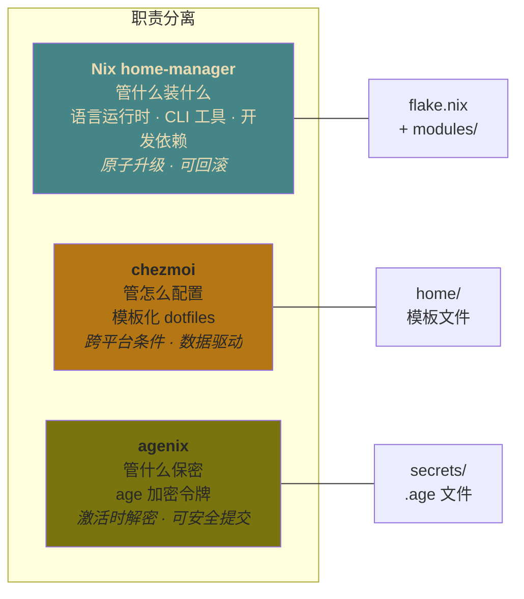
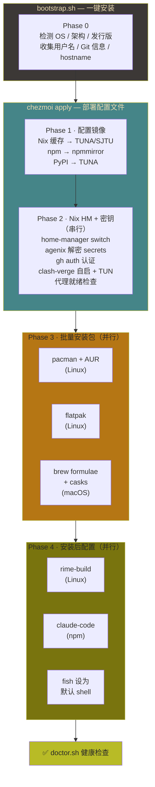
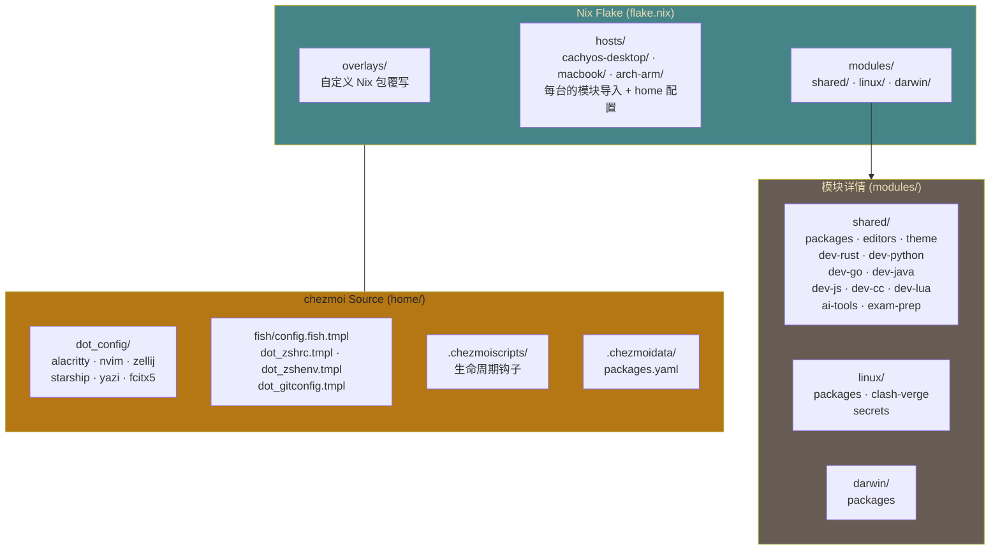
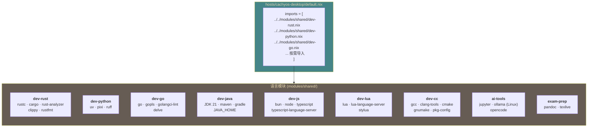
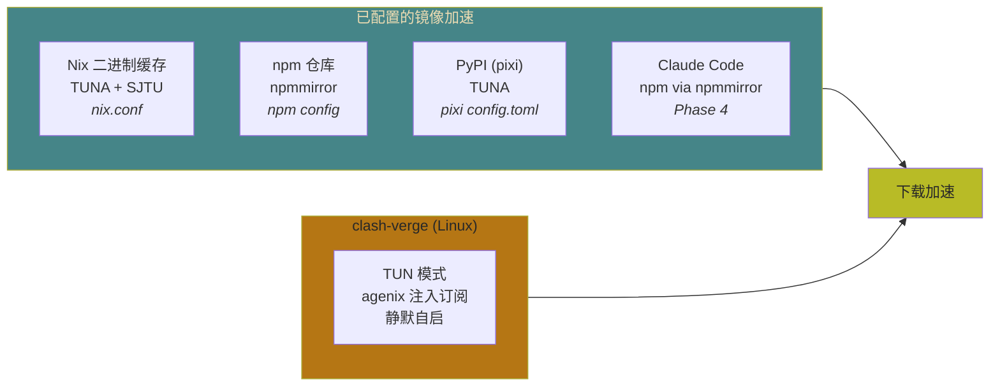
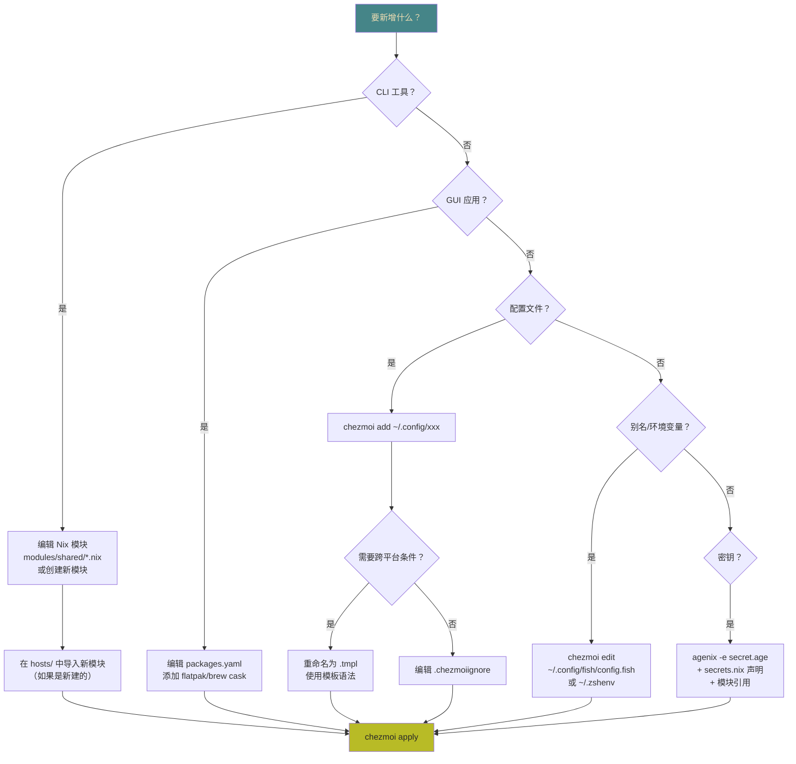
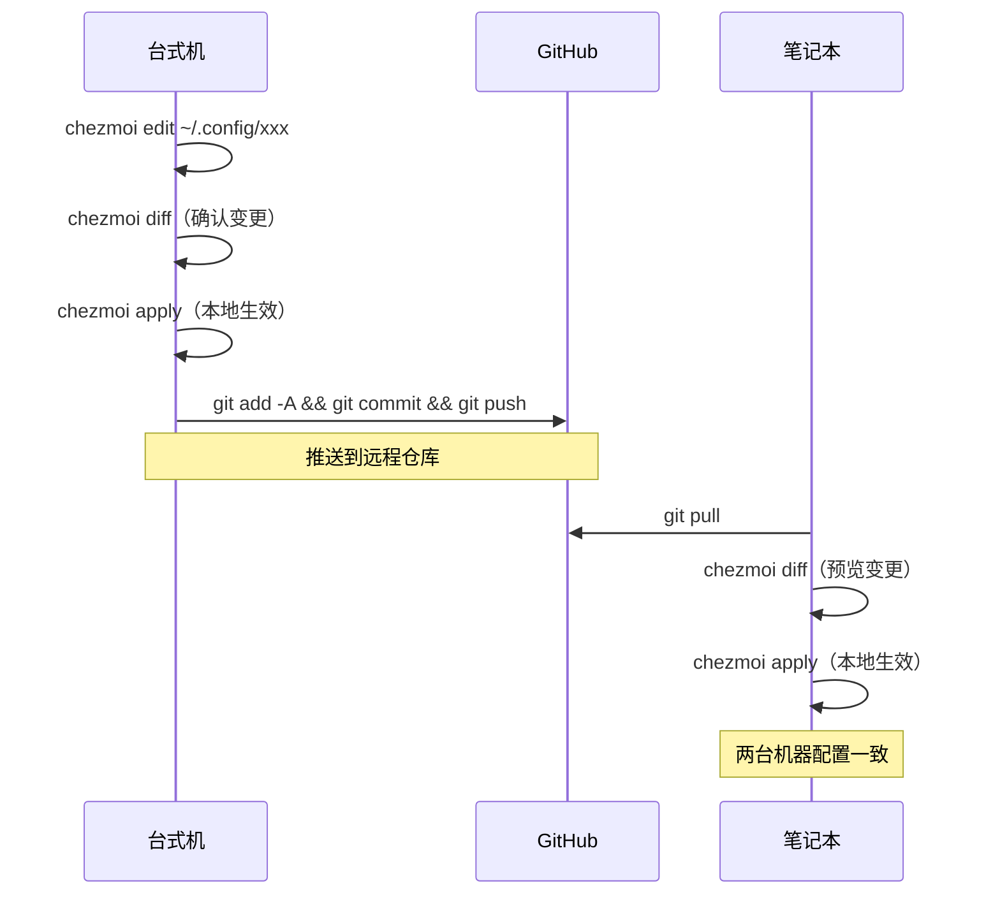
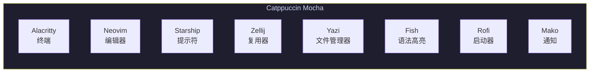

<div align="center">

# ~/dotfiles

**跨平台开发环境 — 声明式、可复现、有主见。**

*一个仓库管理两台机器、八种语言、所有配置。*

[](https://nixos.org)
[](https://github.com/nix-community/home-manager)
[](https://www.chezmoi.io)
[](LICENSE)
[]()

</div>

---

## 目录

- [设计理念](#设计理念)
- [目标机器](#目标机器)
- [系统架构](#系统架构)
- [快速开始](#快速开始)
- [仓库结构](#仓库结构)
- [工具清单与快捷键](#工具清单与快捷键)
  - [终端与 Shell](#终端与-shell)
  - [编辑器与开发工具](#编辑器与开发工具)
  - [现代 CLI 替代工具](#现代-cli-替代工具)
  - [开发语言工具链](#开发语言工具链)
  - [Wayland 桌面组件 (仅 Linux)](#wayland-桌面组件-仅-linux)
  - [GUI 应用](#gui-应用)
- [编排管线](#编排管线)
- [密钥管理](#密钥管理)
- [国内网络优化](#国内网络优化)
- [如何新增工具](#如何新增工具)
- [日常维护指南](#日常维护指南)
- [主题](#主题)

## 设计理念

本仓库将开发环境视为**声明式系统**，三个工具各司其职：



## 目标机器

| 机器 | 系统 | 架构 | 硬件 | Hostname |
|------|------|------|------|----------|
| 台式机 | CachyOS (Arch) | x86_64 | i9-14900KF · 64 GB | `cachyos-desktop` |
| 笔记本 | macOS Sequoia | aarch64 | Apple Silicon | `macbook` |
| ARM 虚拟机 | Arch Linux ARM | aarch64 | OrbStack VM | `arch-arm` |

## 系统架构

### 激活管线总览



### 职责分层

| 层级 | 工具 | 职责 | 作用域 |
|------|------|------|--------|
| **L0** 系统层 | `pacman` / `brew` | 内核、驱动、Wayland 合成器、平台级包 | 系统级 |
| **L1** 用户层 | Nix `home-manager` | CLI 工具、开发工具链、语言运行时、字体 | `~/` |
| **L2** GUI 层 | `flatpak` / `brew --cask` | 沙箱化 GUI 应用（浏览器、通讯、媒体） | 系统级 |
| **L3** 配置层 | `chezmoi` | 所有 dotfiles，支持模板和跨平台条件 | `~/.config/` `~/.*` |
| **密钥层** | `agenix` | age 加密的 secrets，激活时解密 | `$XDG_RUNTIME_DIR/agenix/` |

### Flake 与 chezmoi 的关系



## 快速开始

一条命令 — CachyOS 和 macOS 通用：

```bash
# GitHub（推荐）
curl -fsSL https://raw.githubusercontent.com/viryoke/dotfiles/main/scripts/bootstrap.sh | bash

# GitCode 镜像（国内加速）
curl -fsSL https://gitcode.com/viryoke/dotfiles/raw/main/scripts/bootstrap.sh | bash
```

脚本会自动完成以下步骤：

1. **检测** 操作系统、架构和现有配置
2. **收集** 用户名、Git 身份信息、目标 hostname（尽可能自动检测）
3. **安装** `git`、`chezmoi`、Nix（单用户模式）
4. **克隆** 本仓库到 `~/dotfiles`
5. **部署** 配置文件（`chezmoi apply`）
6. **激活** home-manager + 编排安装包（4 阶段管线）
7. **验证** 环境健康状态（`doctor.sh`）

<details>
<summary>手动安装</summary>

### CachyOS Linux

```bash
git clone https://github.com/viryoke/dotfiles.git ~/dotfiles

# 配置双推送（GitHub + GitCode）
git -C ~/dotfiles remote set-url --add --push origin https://github.com/viryoke/dotfiles.git
git -C ~/dotfiles remote set-url --add --push origin https://gitcode.com/viryoke/dotfiles.git

# 安装 Nix（单用户）
sh <(curl -L https://nixos.org/nix/install) --no-daemon
source ~/.nix-profile/etc/profile.d/nix.sh

# 安装 chezmoi
sudo pacman -S --needed chezmoi

# 配置 chezmoi
mkdir -p ~/.config/chezmoi
cat > ~/.config/chezmoi/chezmoi.toml << 'EOF'
sourceDir = "~/dotfiles/home"
workingTree = "~/dotfiles"

[data]
username = "<你的用户名>"
hostname = "<你的主机名>"

[data.git]
name = "<你的姓名>"
email = "<你的邮箱>"
EOF

# 部署
chezmoi apply

# 可选：交互式安装系统包
~/dotfiles/scripts/install-packages.sh
```

### macOS

```bash
xcode-select --install
/bin/bash -c "$(curl -fsSL https://raw.githubusercontent.com/Homebrew/install/HEAD/install.sh)"
brew install git chezmoi

git clone https://github.com/viryoke/dotfiles.git ~/dotfiles

# 配置双推送（GitHub + GitCode）
git -C ~/dotfiles remote set-url --add --push origin https://github.com/viryoke/dotfiles.git
git -C ~/dotfiles remote set-url --add --push origin https://gitcode.com/viryoke/dotfiles.git

sh <(curl -L https://nixos.org/nix/install) --no-daemon
source ~/.nix-profile/etc/profile.d/nix.sh

mkdir -p ~/.config/chezmoi
cat > ~/.config/chezmoi/chezmoi.toml << 'EOF'
sourceDir = "~/dotfiles/home"
workingTree = "~/dotfiles"

[data]
username = "<你的用户名>"
hostname = "<你的主机名>"

[data.git]
name = "<你的姓名>"
email = "<你的邮箱>"
EOF

chezmoi apply
```

</details>

## 仓库结构

```
~/dotfiles/
├── flake.nix                           Nix flake 入口（home-manager）
├── flake.lock                          锁定依赖版本
│
├── hosts/                              每台机器的 home-manager 配置
│   ├── cachyos-desktop/
│   │   ├── default.nix                   模块导入 + home 配置
│   │   └── hardware.nix                  硬件相关设置
│   ├── macbook/
│   │   └── default.nix                   模块导入 + home 配置
│   └── arch-arm/
│       └── default.nix                   模块导入 + home 配置（aarch64-linux）
│
├── modules/                            可复用的 Nix 模块
│   ├── shared/                         跨平台模块
│   │   ├── packages.nix                  核心 CLI 工具、shell、starship
│   │   ├── editors.nix                   neovim、tree-sitter、ripgrep
│   │   ├── theme.nix                     JetBrains Mono + Noto CJK 字体
│   │   ├── dev-rust.nix                  rustc、cargo、rust-analyzer
│   │   ├── dev-python.nix               uv、pixi、ruff
│   │   ├── dev-go.nix                    go、gopls、golangci-lint、delve
│   │   ├── dev-java.nix                  JDK 21、maven、gradle
│   │   ├── dev-js.nix                    bun、node、typescript
│   │   ├── dev-cc.nix                    gcc、clang、cmake
│   │   ├── dev-lua.nix                   lua、lua-language-server、stylua
│   │   ├── ai-tools.nix                  jupyter、ollama (Linux)、opencode
│   │   ├── ai-learning.nix               PyPI 镜像配置（pixi）
│   │   └── exam-prep.nix                 pandoc、texlive
│   ├── linux/
│   │   ├── packages.nix                  yazi、zellij、cliphist
│   │   ├── clash-verge.nix               代理客户端
│   │   └── secrets.nix                   agenix 密钥声明
│   └── darwin/
│       └── packages.nix                  yazi、zellij
│
├── home/                               chezmoi 源状态 → ~/
│   ├── dot_config/                     → ~/.config/
│   │   ├── alacritty/alacritty.toml.tmpl 终端（Catppuccin Mocha、JetBrains Mono）
│   │   ├── nvim/                         Neovim（LazyVim 发行版）
│   │   │   ├── init.lua                    插件配置 + lazy.nvim 引导
│   │   │   └── lua/plugins/catppuccin.lua  Catppuccin Mocha 主题
│   │   ├── zellij/                       终端复用器
│   │   │   ├── config.kdl                  主题 + 行为配置
│   │   │   ├── keybindings.kdl             Vim 风格快捷键
│   │   │   └── layouts/                    default.kdl、dev.kdl
│   │   ├── fish/config.fish.tmpl          Fish shell（主 shell：别名、环境变量、工具初始化）
│   │   ├── starship.toml                 Shell 提示符（Catppuccin Mocha powerline）
│   │   ├── yazi/theme.toml               文件管理器主题
│   │   └── fcitx5/                       输入法（仅 Linux）
│   ├── dot_zshrc.tmpl                  → ~/.zshrc（fallback：加载 Nix 后 exec fish）
│   ├── dot_zshenv.tmpl                 → ~/.zshenv（XDG、locale、PATH — 非 shell 进程用）
│   ├── dot_gitconfig.tmpl              → ~/.gitconfig（delta、gh 认证）
│   ├── dot_bashrc.tmpl                 → ~/.bashrc（备用）
│   ├── dot_local/                      → ~/.local/
│   │   ├── bin/                            用户脚本（rime-build.sh）
│   │   └── share/fcitx5/rime/              Rime 输入法配置
│   ├── .chezmoiscripts/                生命周期钩子
│   │   ├── run_once_before_...sh.tmpl     Phase 0：前置检查 + Nix 安装
│   │   └── run_onchange_orchest.sh.tmpl   Phase 1–4：完整编排
│   ├── .chezmoiignore                  平台条件忽略
│   ├── .chezmoiexternal.yaml.tmpl      外部依赖（rime-ice）
│   └── .chezmoidata/packages.yaml      包清单（pacman/flatpak/brew）
│
├── overlays/                           自定义 Nix overlays
│   └── default.nix
├── secrets/                            agenix 加密的密钥（.age）
│   ├── secrets.nix                       公钥 → 密钥映射
│   ├── github_token.age                  GitHub CLI 认证
│   ├── gitcode_token.age                 GitCode 认证
│   └── clash_subscription.age            代理订阅 URL
└── scripts/
    ├── bootstrap.sh                    一键安装脚本
    ├── configure-nix-mirrors.sh        Nix 镜像配置（共享）
    ├── doctor.sh                       环境健康检查
    └── install-packages.sh             交互式包安装（仅 Linux）
```

## 工具清单与快捷键

### 终端与 Shell

#### Alacritty — GPU 加速终端模拟器

> 配置文件：`home/dot_config/alacritty/alacritty.toml.tmpl` → `~/.config/alacritty/alacritty.toml`
>
> 主题：Catppuccin Mocha · 字体：JetBrains Mono Nerd Font 14pt · 透明度：0.95

#### Fish — 主 Shell

> 配置文件：`home/dot_config/fish/config.fish.tmpl` → `~/.config/fish/config.fish`
>
> 内置语法高亮 · 自动建议 · fzf · zoxide · starship

| 快捷键 | 功能 |
|--------|------|
| `Ctrl+R` | fzf 历史搜索 |
| `Ctrl+T` | fzf 文件搜索（插入路径） |
| `Alt+C` | fzf 目录跳转（cd） |
| `Tab` | 自动补全（支持 fzf 模糊匹配） |
| `→` | 接受灰色自动建议 |

| 别名 | 实际命令 | 说明 |
|------|----------|------|
| `ll` | `eza -la --icons --git` | 详细文件列表 + git 状态 |
| `la` | `eza -a --icons` | 显示所有文件 |
| `lt` | `eza --tree --icons --level=2` | 树形视图（2 层） |
| `lg` | `lazygit` | Git TUI |
| `v` / `vi` | `nvim` | 编辑器 |
| `z` | `zellij attach -c main` | 连接 zellij 主会话 |

> `.zshrc` 仅作为 fallback：加载 Nix 环境后自动 `exec fish`。

#### Starship — 跨 Shell 提示符

> 配置文件：`home/dot_config/starship.toml` → `~/.config/starship.toml`
>
> 样式：Catppuccin Mocha powerline，显示 OS 图标 / 用户 / 目录 / Git / 语言版本 / Nix / 时间

#### Zellij — 终端复用器

> 配置文件：`home/dot_config/zellij/` → `~/.config/zellij/`
>
> 主题：Catppuccin Mocha · 模式：简化 UI · 退出行为：detach

**两种布局：**

| 布局 | 文件 | 说明 |
|------|------|------|
| `default` | `layouts/default.kdl` | 单面板 + 标签栏 + 状态栏 |
| `dev` | `layouts/dev.kdl` | 左 20% yazi + 右 80% nvim |

**快捷键：**

| 模式 | 快捷键 | 功能 |
|------|--------|------|
| 全局 | `Ctrl+Q` | 退出 |
| **Pane 模式** | | |
| | `h / j / k / l` | 左/下/上/右 切换焦点 |
| | `n` | 新建面板 |
| | `d` | 下方新建面板 |
| | `r` | 右方新建面板 |
| | `x` | 关闭当前面板 |
| | `f` | 切换全屏 |
| | `p` | 切换焦点 |
| **Tab 模式** | | |
| | `h / l` | 上一个 / 下一个标签 |
| | `n` | 新建标签 |
| | `x` | 关闭标签 |
| | `r` | 重命名标签 |

> 使用 `z` 命令（即 `zellij attach -c main`）快速连接主会话。

### 编辑器与开发工具

#### Neovim — 主编辑器

> 配置文件：`home/dot_config/nvim/` → `~/.config/nvim/`
>
> 基于 [LazyVim](https://www.lazyvim.org/) 发行版 · 主题：Catppuccin Mocha

**已启用的语言支持：**
Python · Go · Rust · Java · TypeScript · JSON · YAML · Markdown · Docker · Terraform

**已启用的功能扩展：**
`mini-files`（文件浏览器） · `outline`（符号大纲） · `dap.core`（调试） · `test.core`（测试）

| 快捷键 | 功能 |
|--------|------|
| `<Space>` | LazyVim leader 键 |
| `<Space>e` | 打开文件浏览器 |
| `<Space>f` | 模糊搜索文件 |
| `<Space>/` | 模糊搜索内容 |
| `<Space>sg` | 搜索 Git 文件 |
| `<Space>sb` | 搜索缓冲区 |
| `<Space>gd` | 转到定义 |
| `<Space>gr` | 查找引用 |
| `<Space>ca` | 代码操作 |
| `<Space>xx` | 打开诊断面板 |

> 完整快捷键列表：在 Neovim 中输入 `<Space>` 后查看 which-key 提示。

#### Lazygit — Git TUI

> 启动方式：`lg` 别名 或 `lazygit` 命令

| 快捷键 | 功能 |
|--------|------|
| `?` | 帮助 |
| `Space` | 暂存/取消暂存 |
| `c` | 提交 |
| `p` / `P` | pull / push |
| `n` | 新建分支 |
| `M` | 合并到当前分支 |
| `[` / `]` | 切换面板 |
| `q` | 退出 |

#### Yazi — 终端文件管理器

> 配置文件：`home/dot_config/yazi/theme.toml` → `~/.config/yazi/theme.toml`
>
> 主题：Catppuccin Mocha

| 快捷键 | 功能 |
|--------|------|
| `h / j / k / l` | 上级 / 下 / 上 / 进入目录 |
| `Space` | 选中/取消选中 |
| `y` | 复制（yank） |
| `p` | 粘贴 |
| `x` | 剪切 |
| `d` | 删除（移到回收站） |
| `D` | 永久删除 |
| `a` | 新建文件/目录（末尾加 `/`） |
| `r` | 重命名 |
| `z` | 使用 zoxide 跳转 |
| `/` | 搜索 |
| `s` | 使用 fd 搜索 |
| `.` | 显示隐藏文件 |
| `q` | 退出 |
| `o` | 用默认程序打开 |
| `~` | 帮助 |

#### Git — 版本控制

> 配置文件：`home/dot_gitconfig.tmpl` → `~/.gitconfig`
>
> 特性：delta 差异查看器 · gh 凭证助手 · pull 默认 rebase · push 默认 current

| 别名 | 实际命令 | 说明 |
|------|----------|------|
| `git st` | `status -sb` | 简洁状态 |
| `git co` | `checkout` | 切换分支 |
| `git br` | `branch` | 分支管理 |
| `git ci` | `commit` | 提交 |
| `git lg` | `log --graph ...` | 图形化日志 |
| `git last` | `log -1 HEAD --stat` | 最后一次提交 |
| `git undo` | `reset HEAD~1 --mixed` | 撤销最后一次提交 |
| `git amend` | `commit --amend --no-edit` | 修改最后一次提交 |

### 现代 CLI 替代工具

> 由 `modules/shared/packages.nix` 安装

| 传统命令 | 替代工具 | 说明 |
|----------|----------|------|
| `ls` | **eza** | 彩色输出、图标、Git 状态、树形视图 |
| `cat` | **bat** | 语法高亮、行号、Git 集成 |
| `find` | **fd** | 更快、正则语法、彩色输出 |
| `grep` | **ripgrep** (`rg`) | 超快搜索、自动忽略 .gitignore |
| `cd` | **zoxide** (`z`) | 智能目录跳转（基于访问频率） |
| `tree` | **eza --tree** | 树形视图（eza 自带） |
| `top` | **htop** / **btop** | 交互式进程监控 |
| `diff` | **delta** | 语法高亮差异查看器（集成 git diff） |
| `awk`/`sed` | **jq** | JSON 命令行处理器 |

**常用示例：**

```bash
# eza — 替代 ls
ll                      # eza -la --icons --git
lt                      # eza --tree --icons --level=2

# bat — 替代 cat
bat README.md            # 语法高亮查看
bat -n init.lua          # 带行号

# fd — 替代 find
fd '\.nix$'              # 查找所有 .nix 文件
fd -t d modules           # 查找目录

# ripgrep — 替代 grep
rg 'home-manager'         # 搜索关键词
rg -t nix 'import'        # 只在 nix 文件中搜索

# zoxide — 替代 cd
z dotfiles               # 智能跳转到最常访问的目录
z nvim                   # 跳到 ~/.config/nvim 或类似路径

# jq — JSON 处理
cat flake.lock | jq '.nodes'
echo '{"a":1}' | jq '.a'
```

### 开发语言工具链

每个语言是一个独立的 Nix 模块，按需导入到 `hosts/` 配置中。



| 模块文件 | 语言 | 安装的包 |
|----------|------|----------|
| `dev-rust.nix` | Rust | rustc, cargo, rust-analyzer, clippy, rustfmt |
| `dev-python.nix` | Python | uv, pixi, ruff |
| `dev-go.nix` | Go | go, gopls, golangci-lint, delve |
| `dev-java.nix` | Java | JDK 21, maven, gradle |
| `dev-js.nix` | JS/TS | bun, node, typescript, typescript-language-server |
| `dev-lua.nix` | Lua | lua, lua-language-server, stylua |
| `dev-cc.nix` | C/C++ | gcc, clang-tools, cmake, gnumake, pkg-config |
| `ai-tools.nix` | AI/ML | jupyter, ollama (仅 Linux), opencode |
| `exam-prep.nix` | 写作排版 | pandoc, texlive (scheme-small) |

> **注意**：`dev-python` 仅安装包管理器和 linter（uv, pixi, ruff），Python 本身通过 uv/pixi 按需管理。`dev-go` 使用 `programs.go.enable = true` 由 home-manager 管理 Go 语言。

### Wayland 桌面组件 (仅 Linux)

| 组件 | 说明 |
|------|------|
| **fcitx5 + rime** | 输入法框架 + Rime 拼音（rime-ice 方案，每 30 天自动更新） |
| **clash-verge-rev** | 代理客户端（TUN 模式、agenix 注入订阅、静默启动） |
| **cliphist** | 剪贴板历史管理器 |
| **grim + slurp** | 截图工具 |
| **swww** | 壁纸守护进程 |
| **wlogout** | 注销/锁屏/重启菜单 |
| **mako** | 通知守护进程（Catppuccin 主题） |
| **rofi-wayland** | 应用启动器 + 菜单脚本 |

#### Rofi 菜单快捷方式

| 别名 | 功能 |
|------|------|
| `launcher` | 应用启动器（drun） |
| `clipboard` | 剪贴板历史浏览 |
| `screenshot` | 截图菜单（全屏/区域/窗口/延时） |
| `emoji` | Emoji 选择器 |
| `powermenu` | 电源菜单（wlogout） |
| `wallpaper` | 壁纸选择器（swww） |

### GUI 应用

**Linux (Flatpak)：** Firefox · Telegram · Spotify · Discord · Anki · Obsidian

**Linux (AUR)：** 百度网盘

**macOS (Homebrew Cask)：** Chrome · Alacritty · Telegram · Clash Verge Rev · 百度网盘 · Obsidian · Raycast · Stats

## 编排管线

当 `chezmoi apply` 执行时，`run_onchange_orchest.sh` 钩子会启动 4 阶段编排：

| 阶段 | 类型 | 内容 |
|------|------|------|
| **Phase 1** 配置镜像 | 串行 | Nix 二进制缓存 → TUNA/SJTU、npm → npmmirror |
| **Phase 2** Nix + 密钥 + 代理 | 串行 | home-manager switch → agenix 解密 → gh auth → clash-verge 自启 + TUN → 代理就绪检查 |
| **Phase 3** 批量安装包 | **并行** | pacman + AUR + flatpak (Linux) / brew formulae + casks (macOS) |
| **Phase 4** 安装后配置 | **并行** | rime-build (Linux) + claude-code (npm) + fish 设为默认 shell |

> Phase 3 和 Phase 4 中各子任务并发执行，全部完成后再进入下一阶段。Phase 2 结束后会检查代理是否就绪，若未就绪会提示等待或跳过。

## 密钥管理

使用 [agenix](https://github.com/ryantm/agenix)（age 加密）。`.age` 文件可安全提交到 Git — 只有持有对应 SSH 私钥的人才能解密。

| 密钥 | 用途 | 解密路径 |
|------|------|----------|
| `github_token.age` | GitHub CLI 认证 | `$XDG_RUNTIME_DIR/agenix/github_token` |
| `gitcode_token.age` | GitCode 认证 | `$XDG_RUNTIME_DIR/agenix/gitcode_token` |
| `clash_subscription.age` | 代理订阅 URL | `$XDG_RUNTIME_DIR/agenix/clash_subscription` |

两台机器（台式机 + 笔记本的 SSH 公钥）均可解密。

### 管理密钥

```bash
# 编辑密钥（需要 age 身份密钥）
cd ~/dotfiles/secrets
agenix -e github_token.age

# 新增密钥
# 1. 加密明文
echo "secret-value" | agenix -e new_secret.age
# 2. 在 secrets/secrets.nix 中声明公钥映射
# 3. 在模块中引用：age.secrets.new_secret.file = ../../secrets/new_secret.age;
# 4. 删除明文文件
```

## 国内网络优化

本环境针对国内网络做了全链路镜像加速：



| 组件 | 镜像 | 配置位置 |
|------|------|----------|
| Nix 二进制缓存 | TUNA + SJTU | `scripts/configure-nix-mirrors.sh` |
| npm 仓库 | npmmirror | `run_onchange_orchest.sh` |
| PyPI (pixi) | TUNA | `modules/shared/ai-learning.nix` |
| Claude Code | npm (npmmirror) | `run_onchange_orchest.sh` |

## 如何新增工具

### 场景一：新增 Nix 管理的 CLI 工具

适用于：开发语言工具链、CLI 工具等需要可复现安装的工具。

**方式 A：添加到现有模块**

```nix
# modules/shared/packages.nix — 添加跨平台 CLI 工具
home.packages = with pkgs; [
  # ... 现有工具
  httpie    # 新增：友好的 HTTP 客户端
];
```

**方式 B：创建新模块（推荐用于新语言/新领域）**

```bash
# 1. 创建模块文件
cat > modules/shared/dev-zig.nix << 'EOF'
{ pkgs, ... }: {
  home.packages = with pkgs; [
    zig
    zls    # language server
  ];
}
EOF
```

```nix
# 2. 在 hosts/ 配置中导入
# hosts/cachyos-desktop/default.nix (和/或 macbook/default.nix)
imports = [
  # ... 现有导入
  ../../modules/shared/dev-zig.nix    # 新增
];
```

```bash
# 3. 激活
cd ~/dotfiles && chezmoi apply
```

### 场景二：新增 GUI 应用

GUI 应用通过 `home/.chezmoidata/packages.yaml` 声明，编排管线会自动安装。

```yaml
# home/.chezmoidata/packages.yaml
packages:
  linux:
    flatpak:
      - "org.mozilla.firefox"
      # 新增：
      - "com.visualstudio.code"
  darwin:
    casks:
      - "google-chrome"
      # 新增：
      - "visual-studio-code"
```

```bash
# 激活（编排管线 Phase 3 自动安装）
chezmoi apply
```

### 场景三：新增配置文件（dotfile）

```bash
# 1. 将现有配置纳入 chezmoi 管理
chezmoi add ~/.config/kitty    # 自动复制到 home/dot_config/kitty/

# 2. 如需跨平台条件，编辑 .chezmoiignore
# home/.chezmoiignore
{{ if ne .chezmoi.os "linux" }}
.config/fcitx5
{{ end }}

# 3. 如需模板化（使用变量），重命名为 .tmpl
mv home/dot_config/kitty/kitty.conf home/dot_config/kitty/kitty.conf.tmpl
# 然后在文件中使用 chezmoi 模板语法：
# {{ if eq .chezmoi.os "linux" }}
# font-size 14
# {{ else }}
# font-size 13
# {{ end }}

# 4. 部署
chezmoi apply
```

### 场景四：新增 Shell 别名或环境变量

```bash
# 别名 / 交互式环境变量：编辑 fish 配置
chezmoi edit ~/.config/fish/config.fish

# 非 shell 进程需要的环境变量：编辑 zshenv
chezmoi edit ~/.zshenv

# 部署
chezmoi apply
```

### 场景五：新增 agenix 密钥

```bash
# 1. 加密明文
echo "my-secret-value" | agenix -e secrets/my_new_secret.age

# 2. 在 secrets/secrets.nix 中声明
{
  "my_new_secret.age".publicKeys = allKeys;
}

# 3. 在模块中引用（例如 modules/linux/secrets.nix）
age.secrets.my_new_secret = {
  file = ../../secrets/my_new_secret.age;
};

# 4. 激活
chezmoi apply
```

### 新增工具流程图



## 日常维护指南

### 编辑 → 预览 → 应用（核心循环）

```bash
# 1. 编辑配置文件
chezmoi edit ~/.config/alacritty/alacritty.toml  # 自动打开源文件

# 2. 预览变更（对比当前文件与源状态）
chezmoi diff                               # 查看所有差异
chezmoi diff ~/.zshrc                      # 查看单个文件

# 3. 应用变更到本地
chezmoi apply                              # 部署所有
chezmoi apply ~/.zshrc                     # 只部署单个文件

# 4. 提交并同步
cd ~/dotfiles
git add -A
git commit -m "update: 修改了 xxx"
git push
```

### 双机同步

仓库同时推送至 GitHub 和 GitCode，`git push` 一次同步两个平台：

```
origin (fetch) → https://github.com/viryoke/dotfiles.git
origin (push)  → https://github.com/viryoke/dotfiles.git
origin (push)  → https://gitcode.com/viryoke/dotfiles.git
```



### Nix 依赖维护

```bash
# 更新 flake.lock（拉取最新 nixpkgs、home-manager 等）
cd ~/dotfiles
nix flake update

# 查看将更新的内容
nix flake lock --refresh

# 激活更新后的配置
chezmoi apply    # 编排管线会自动运行 home-manager switch
```

### 环境健康检查

```bash
# 运行完整健康检查
~/dotfiles/scripts/doctor.sh
```

检查项目包括：
- ✅ 核心工具：chezmoi、nix、git
- ✅ Shell：fish、starship、zellij
- ✅ 编辑器：neovim、lazygit
- ✅ 开发工具：go、python3、uv、rustc、cargo、java、bun、node、lua
- ✅ CLI 工具：ripgrep、fd、fzf、eza、zoxide、bat、yazi、jq
- ✅ Git 配置：user.name、user.email、SSH 密钥
- ✅ Wayland 组件：rofi、cliphist、grim、slurp、mako、wlogout、swww、fcitx5
- ✅ chezmoi 状态：源目录、未同步差异数量

### chezmoi 常用命令速查

| 命令 | 说明 |
|------|------|
| `chezmoi edit <file>` | 编辑源文件 |
| `chezmoi diff` | 查看所有差异 |
| `chezmoi apply` | 部署所有变更 |
| `chezmoi apply <file>` | 只部署单个文件 |
| `chezmoi add <file>` | 将现有文件纳入管理 |
| `chezmoi execute-template` | 执行模板（查看变量值） |
| `chezmoi data` | 查看所有模板数据 |
| `chezmoi status` | 查看管理状态 |
| `chezmoi managed` | 列出所有受管理的文件 |
| `chezmoi unmanaged` | 列出未管理的配置文件 |

### 故障排查

```bash
# 1. "ignoring untrusted substituter" 警告（macOS 常见）
# 原因：当前用户不在 /etc/nix/nix.conf 的 trusted-users 列表中
echo "trusted-users = root $USER" | sudo tee -a /etc/nix/nix.conf

# 2. home-manager switch 失败？
# 先检查 flake 语法
cd ~/dotfiles && nix flake check

# 手动运行 home-manager（查看详细错误）
nix run home-manager -- switch --flake ".#viryoke@cachyos-desktop" --impure -v

# 3. 编排管线失败？
# 单独运行某个阶段（脚本内容参考 run_onchange_orchest.sh.tmpl）
chezmoi cat ~/.local/share/chezmoi/.chezmoiscripts/run_onchange_orchest.sh

# 4. 回滚到上一次 home-manager 配置
home-manager generations        # 查看所有代际
home-manager switch --rollback  # 回滚

# 5. agenix 解密失败？
# 确认 SSH 密钥已加载
ssh-add -l
# 重新导入密钥
ssh-add ~/.ssh/id_ed25519
```

## 主题

**Catppuccin Mocha** — 在所有视觉组件中保持一致：



| 颜色 | 色值 | 用途 |
|------|------|------|
| Base | `#1e1e2e` | 终端/编辑器/复用器背景 |
| Text | `#cdd6f4` | 正文文字 |
| Red | `#f38ba8` | 错误、删除 |
| Green | `#a6e3a1` | 成功、普通模式 |
| Yellow | `#f9e2af` | 警告、高亮 |
| Blue | `#89b4fa` | 信息、目录、命令 |
| Mauve | `#cba6f7` | 特殊标记、提示符 |
| Peach | `#fab387` | 时间、强调 |
| Surface0 | `#313244` | 选中背景、对比面 |

字体：**JetBrains Mono Nerd Font**（14pt，加粗渲染）+ **Noto Sans CJK**（中日韩文字覆盖）。

## License

[MIT](LICENSE) — Copyright (c) 2026 Zhou Mingjun (viryoke)
